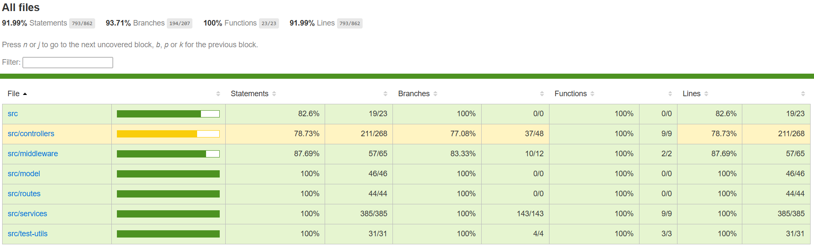
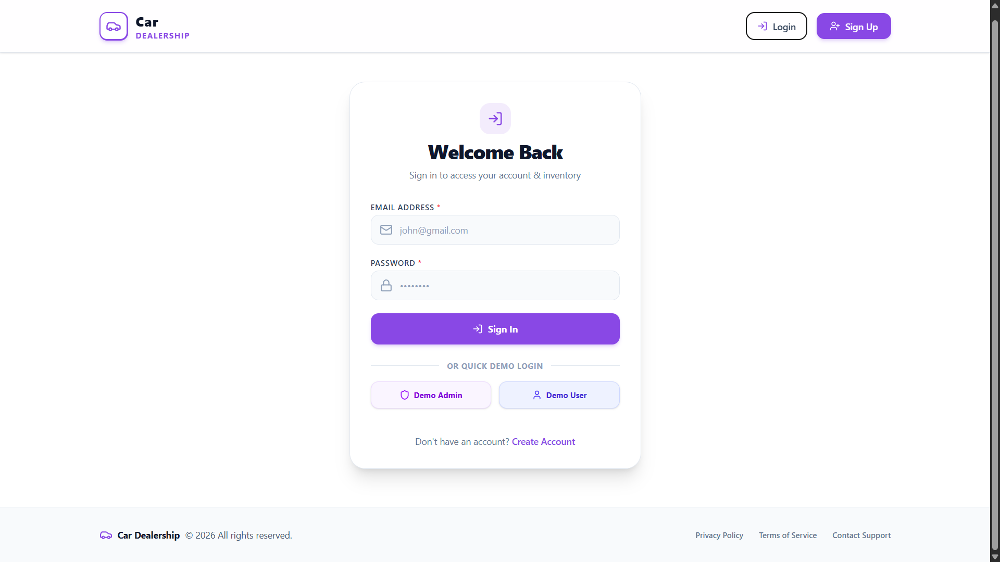
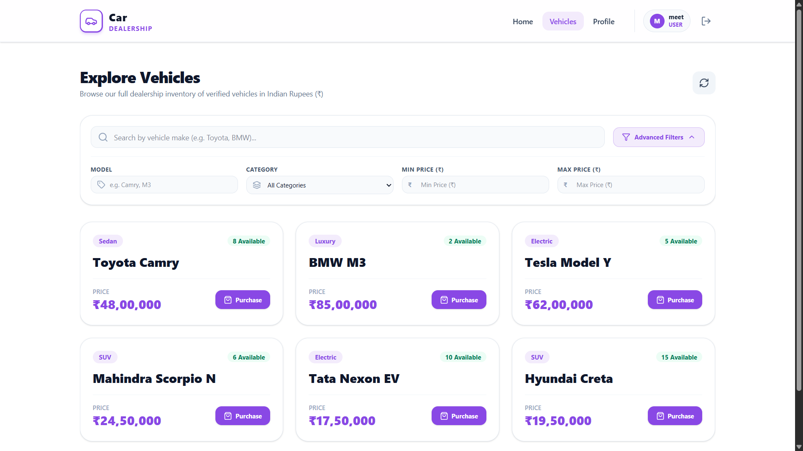
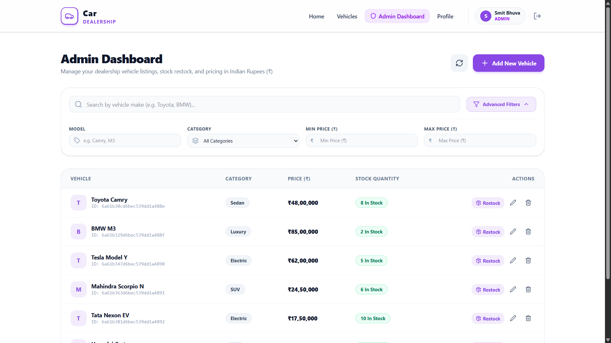
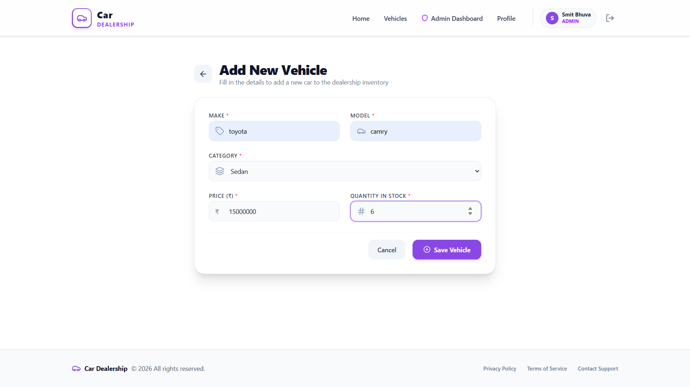

# 🚗 Car Dealership Inventory System

<p align="center">
  <a href="https://car-dealership-inventory-system-pro.vercel.app/">
    
  </a>
  
  
  
  
  
  
  
</p>

A full-stack **MERN + TypeScript** web application for managing a car dealership's vehicle inventory - with role-based access control, secure authentication, and a complete CRUD workflow for vehicles.

<p align="center"  style="font-size: 22px;">
  <strong>🔗 Live Demo:</strong>
  <a href="https://car-dealership-inventory-system-pro.vercel.app">
    https://car-dealership-inventory-system-pro.vercel.app
  </a>
</p>

---

## 🧭 Project Overview

The **Car Dealership Inventory System** is a full-stack web application that digitizes how a car dealership manages its vehicle stock, sales, and staff access. It replaces manual/spreadsheet-based inventory tracking with a centralized, role-aware platform where **admins** manage the vehicle catalog and **users/customers** can browse and purchase vehicles.

### Purpose & Objectives

- Provide a **single source of truth** for dealership inventory (make, model, category, price, stock quantity).
- Enforce **role-based access control** so only admins can add, update, restock, or delete vehicles.
- Give customers a smooth, secure way to **browse, search, and purchase** vehicles.
- Demonstrate a production-style **TypeScript MERN architecture** with authentication, authorization, automated testing, and a real cloud deployment.


## ✨ Features

### 👤 User Features
- Register and log in with a secure, cookie-based session
- Browse the full vehicle catalog
- Search and filter vehicles by make, model, category, and price range
- Purchase a vehicle 
- View personal profile

### 🛠️ Admin Features
- Add new vehicles to the inventory
- Update existing vehicle details
- Restock vehicles
- Delete vehicles from the catalog
- Access an admin-only dashboard, protected from regular users

### 🔒 Security Features
- Passwords hashed with **bcrypt** before storage
- **JWT**-based authentication stored in an **HttpOnly, Secure cookie**
- **Role-based authorization middleware** restricting admin-only routes
- **CORS** configured with an explicit allowlist and credentialed requests


### 🧪 Testing Features
- **Unit tests** for every service function (login, register, add/update/delete/restock/purchase/search/view vehicles), using mocked dependencies
- **Integration tests** for authentication and vehicle API endpoints using an in-memory MongoDB instance
- Test coverage reporting via Jest

---

## 🧰 Tech Stack

| Layer | Technology |
|---|---|
| **Frontend** | React 19, TypeScript, Vite, React Router DOM, Tailwind CSS, Radix UI, React Hook Form, React Hot Toast |
| **Backend** | Node.js, Express.js 5, TypeScript |
| **Database** | MongoDB with Mongoose ODM |
| **Authentication** | JSON Web Tokens (JWT), bcrypt, HttpOnly cookies (`cookie-parser`) |
| **Testing** | Jest, ts-jest, Supertest, mongodb-memory-server |
| **Development Tools** | Nodemon, ts-node, Git & GitHub |

---
## 🧪 Test Coverage

<p align="center">
  
</p>

This project follows **Test-Driven Development (TDD)** principles and includes a comprehensive automated testing suite to ensure reliability and maintainability.

### ✅ Testing Highlights

- 🧪 **80%+ Overall Test Coverage**
- 🔍 **Unit Tests** for controllers and services
- 🌐 **Integration Tests** for REST API endpoints

### 🔄 TDD Workflow

Every feature was developed using the **Red → Green → Refactor** cycle.

1. ❌ **Red** — Write a failing test.
2. ✅ **Green** — Implement the minimum code required to pass.
3. 🔄 **Refactor** — Improve code quality while keeping all tests passing.

### Suite Summary

| Metric | Count |
|---|---|
| Test Suites | 11 total (9 unit, 2 integration) |
| Total Tests | 134 |
| Unit Tests | ✅ All passing (mocked dependencies, no DB required) |


### ▶️ Run the Test Suite

```bash
cd server
npm test              # run all tests
npm run test:coverage # run tests with coverage report
npm run test:watch    # watch mode
```
---

## 📁 Folder Structure

### Backend (`server/`)

```
server/
├── src/
│   ├── app.ts                  # Express app configuration (CORS, middleware, static serving)
│   ├── server.ts                # Entry point — DB connection + server startup
│   ├── config/
│   │   └── db.ts                # MongoDB connection logic
│   ├── controllers/
│   │   ├── authController.ts    # Login / register request handlers
│   │   └── vehicleController.ts # Vehicle CRUD request handlers
│   ├── middleware/
│   │   ├── authenticate.ts      # JWT verification middleware
│   │   └── authorize.ts         # Role-based access control middleware
│   ├── model/
│   │   ├── User.ts              # Mongoose User schema
│   │   └── Vehicle.ts           # Mongoose Vehicle schema
│   ├── routes/
│   │   ├── index.ts             # Root API router
│   │   ├── authRoutes.ts        # /api/auth routes
│   │   └── vehicleRoutes.ts     # /api/vehicles routes
│   ├── services/                # Business logic (one file per operation)
│   │   ├── login.ts
│   │   ├── register.ts
│   │   ├── addVehicle.ts
│   │   ├── updateVehicle.ts
│   │   ├── deleteVehicle.ts
│   │   ├── restockVehicle.ts
│   │   ├── purchaseVehicle.ts
│   │   ├── searchVehicles.ts
│   │   └── viewAllVehicles.ts
│   ├── types/express/           # Custom Express type augmentations
│   ├── test-utils/
│   │   └── db-handler.ts        # In-memory MongoDB setup for tests
│   └── tests/
│       ├── unitTest/             # Service-level unit tests
│       └── integrationTest/      # API-level integration tests
├── jest.config.mjs
├── tsconfig.json
└── package.json
```

### Frontend (`client/`)

```
client/
├── src/
│   ├── main.tsx                 # React entry point
│   ├── App.tsx                  # Root component
│   ├── MainLayout.tsx           # Shared layout wrapper
│   ├── context/
│   │   └── AuthContext.tsx      # Global authentication state (Context API)
│   ├── routes/
│   │   ├── AppRoutes.tsx        # Route definitions
│   │   ├── PrivateRoute.tsx     # Guards routes for authenticated users
│   │   └── AdminRoute.tsx       # Guards routes for admin-only access
│   ├── pages/
│   │   ├── Home.tsx
│   │   ├── Login.tsx
│   │   ├── Signup.tsx
│   │   ├── Vehicles.tsx
│   │   ├── AddVehicle.tsx
│   │   ├── EditVehicle.tsx
│   │   ├── AdminDashboard.tsx
│   │   ├── Profile.tsx
│   │   └── Unauthorized.tsx
│   ├── components/
│   │   ├── AdvancedSearchFilter.tsx
│   │   ├── DeleteConfirmModal.tsx
│   │   ├── PurchaseModal.tsx
│   │   └── RestockModal.tsx
│   └── services/
│       └── api.ts                # Centralized fetch-based API client
├── index.html
├── vite.config.ts
└── package.json
```

---

## ⚙️ Installation & Setup

### Prerequisites
- [Node.js](https://nodejs.org/) v20 or later
- npm
- A [MongoDB](https://www.mongodb.com/) database (local instance or [MongoDB Atlas](https://www.mongodb.com/atlas))
- Git

### 1. Clone the Repository

```bash
git clone https://github.com/Smitbhuva15/Car-Dealership-Inventory-System.git
cd Car-Dealership-Inventory-System
```

### 2. Backend Setup

```bash
cd server
npm install
```

Create a `.env` file inside `server/`:

```env
PORT=5000
NODE_ENV=development
MONGODB_URI=mongodb+srv://<username>:<password>@<cluster-url>/<db-name>
JWT_SECRET=your_super_secret_jwt_key
JWT_EXPIRE=7d
CLIENT_URL=http://localhost:5173
```

Start the backend in development mode:

```bash
npm start
```

### 3. Frontend Setup

```bash
cd client
npm install
```

(Optional) Create a `.env` file inside `client/` if you want the frontend to explicitly target a backend URL during local development:

```env
VITE_BACKEND_URL=http://localhost:5000
```

Start the frontend development server:

```bash
npm run dev
```


Then open **`http://localhost:5173`** in your browser. The Vite dev server proxies `/api` requests to the backend automatically.


---

## 🔌 API Overview


| Method | Endpoint | Description | Auth Required |
|---|---|---|---|
| `POST` | `/api/auth/register` | Register a new user account | ❌ No |
| `POST` | `/api/auth/login` | Authenticate a user and issue a JWT cookie | ❌ No |
| `GET` | `/api/vehicles/view-all` | Retrieve the full list of vehicles | ✅ Yes |
| `GET` | `/api/vehicles/search` | Search/filter vehicles by make, model, category, price | ✅ Yes |
| `POST` | `/api/vehicles/purchase/:id` | Purchase a vehicle (reduces stock) | ✅ Yes |
| `POST` | `/api/vehicles/add` | Add a new vehicle to inventory | ✅ Yes (Admin only) |
| `PUT` | `/api/vehicles/update/:id` | Update an existing vehicle's details | ✅ Yes (Admin only) |
| `DELETE` | `/api/vehicles/delete/:id` | Remove a vehicle from inventory | ✅ Yes (Admin only) |
| `POST` | `/api/vehicles/restock/:id` | Increase stock quantity of a vehicle | ✅ Yes (Admin only) |


---

## 🎨 UI Preview


| Screenshot |
|------------|
|  |
|  |
|  |
|  |


## 🤝 Contributing

Contributions are welcome! To contribute:

1. **Fork** this repository
2. **Clone** your fork locally
   ```bash
   git clone https://github.com/<your-username>/Car-Dealership-Inventory-System.git
   ```
3. **Create a new branch** for your feature or fix
   ```bash
   git checkout -b feature/your-feature-name
   ```
4. **Make your changes** and commit with a clear message
   ```bash
   git commit -m "Add: brief description of your change"
   ```
5. **Push** to your fork
   ```bash
   git push origin feature/your-feature-name
   ```
6. **Open a Pull Request** against the `main` branch of this repository, describing what you changed and why

Please ensure existing tests pass (`npm test`) and add new tests for any new functionality before submitting a PR.

---


## 🤖 My AI Usage

AI tools (including ChatGPT and Claude) were used as a **supporting resource** throughout this project's development - not as a substitute for my own understanding or implementation. Specifically, AI assistance was used for:

- **Brainstorming** the initial project architecture and folder structure
- **Debugging** deployment-specific issues 
- **Code suggestions** for boilerplate patterns

All AI-generated suggestions were **reviewed, tested, and understood** before being incorporated into the codebase. Core application logic, service implementations, database schema design, test writing, manual debugging, and all final architectural and implementation decisions were carried out by me as the developer. This project reflects my own understanding of full-stack development - AI was used as a productivity and learning aid, not as a replacement for the engineering work itself.

---

## 👨‍💻 Author

### 📬 Connect With Me

<div align="center">

[](https://www.linkedin.com/in/smit-bhuva-1007ba314/)
[](https://github.com/Smitbhuva15)


</div>

---

<div align="center">

**⭐ If you found this project helpful, please give it a star!**

*Built with ❤️ by [Smit Bhuva](https://github.com/Smitbhuva15) for [Incubyte](https://incubyte.co)*

</div>